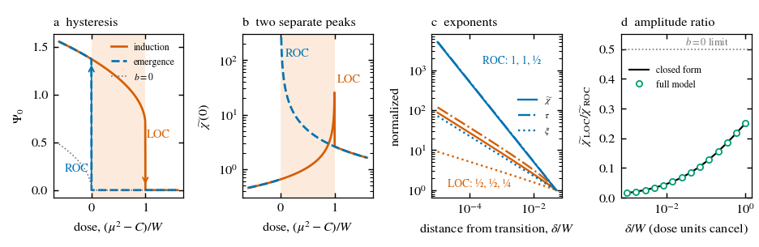

# The Mind–Thought Entanglement (MTE) Framework

**Code for a classical two-field model of conscious unity, with asymmetric critical signatures at loss and recovery of consciousness**

This repository contains the code that generates **every figure and every reported number** of:

> Ning H, Ayana J W, Ding J. *The Mind–Thought Entanglement (MTE) Framework as a Classical Two-Field Model of Conscious Unity, with Asymmetric Critical Signatures at Loss and Recovery of Consciousness.* Submitted to *Neuroscience of Consciousness*, 2026.

> **Note on the name.** MTE is the historical name of the framework. In this work "entanglement" means the mutual constraint between a global experiential state and the context of its contents. The model is entirely classical, and no quantum property is claimed.

---

## The model in brief

A global order parameter Ψ on the cortical sheet is coupled locally and symmetrically to one hidden, damped, propagating context mode φ₀:

```
(∂t² + γ1 ∂t − c1² ∇² + μ²) Ψ + λ Ψ³ = (g1 + g2 Ψ) φ0
(∂t² + γ2 ∂t − c2² ∇² + m²) φ0      = g1 Ψ + (g2/2) Ψ²
```

The model makes two kinds of claim.

- **Linear sector (necessary condition only).** Perturbations propagate on two damped branches (P1). A sustained focal drive produces a two-component spatial response with positive weights (P4). A generalized identity (G1–G3) links the two with no free parameter. The code shows that a conventional cortical model shares this signature: one excitatory field carried by short and long axonal fibres. Passing these tests is therefore necessary but not sufficient.
- **Phase boundary (the consciousness-specific prediction, P5).** The cross-coupling term makes the transition between the unified and non-unified phases discontinuous. Loss of consciousness (LOC) is then a saddle-node, and recovery of consciousness (ROC) is a transcritical bifurcation. The exponents therefore differ:

  | Transition | susceptibility χ | relaxation time τ | correlation length ξ |
  |---|---|---|---|
  | LOC | ½ | ½ | ¼ |
  | ROC | 1 | 1 | ½ |

  These laws apply to the **spatially integrated** evoked response; the local response grows only logarithmically. Each peak is approached from one side only, and the ratio of the two peaks, χ_LOC/χ_ROC = 1/[2(1+√(W/δ))], depends only on the hysteresis width W and the dose distance δ. The ROC exponent requires negligible background drive J: drive moves LOC in proportion to J and ROC in proportion to √J, which is itself a prediction. Because exponents survive any smooth distortion of the dose axis, the asymmetry separates intrinsic bistability from pharmacokinetic error.



*Fig. 3 of the paper, generated by `code/make_figs.py`.*

---

## Quick start

Tested with Python 3.12, NumPy 2.4, SciPy 1.17 and Matplotlib 3.10.

```bash
git clone https://github.com/WakumaAyanaJifar/The-Mind-Thought-Entanglement-Theory-supp.git
cd The-Mind-Thought-Entanglement-Theory-supp
pip install -r requirements.txt
python run_all.py            # everything, about 25 min on one core
python run_all.py --quick    # about 5 min; skips the two recovery studies and draws Fig. 4 from expected_output/
```

Results and figures are written to `outputs/`, and each script's printed output goes to `outputs/logs/`. Reference output is in `expected_output/`. All random seeds are fixed, so the numbers should match; the only expected differences are round-off in zero eigenvalues (about 10⁻¹²) and small changes with other library versions.

---

## What each script reproduces

| Script (`code/`) | Paper | Key result |
|---|---|---|
| `check1.py` | §3.3, Fig. 2b | k=0 resonances; κ₋=0.962, κ₊=3.150, R₋=0.804; identity G1 = 3.030 |
| `hankel_check.py` | §2.4 | two-component form returns χ(0,k) to <10⁻⁹ |
| `twofibre.py` | §3.3, S2 | two-fibre competitor satisfies G1 and G3 (1,125/1,125); mixed sign gives a negative weight (1,445/1,445) |
| `boundary.py` | §3.4, Fig. 3, S4 | slopes −0.504/−0.506/−0.252 (LOC), −1/−1/−0.5 (ROC); peak ratio; post-jump factor 4; bias crossover |
| `boundary_window.py` | §3.4, S4, Table S4 | steady states vs TMS-EEG; window budget; LOC ∝ J and ROC ∝ √J; P2/P5 coexistence |
| `nucleation2d.py` | §3.4, S4 | 2D nucleus barrier 31.0 c²δ/λ_eff; local logarithmic law |
| `potential_splitting.py` | §3.6, Fig. S4 | ΔV = 0.2205 |
| `fisher.py` | §3.8, Table S2 | Jacobian rank 8; Cramér–Rao bounds |
| `recovery7.py` | §3.8, Table S3 | 8-parameter recovery on the k-space grid, 360/360 converge |
| `recovery_sheet.py` | §3.10, Fig. 4 | sheet simulation: recovery map over spacing × SNR, coverage check |
| `static1d.py` | S3, Fig. S2a–c, Table S1 | d=1 threshold state (peak 0.612), survey 63/18, convergence, dynamics |
| `static2d.py`, `static2d_conv.py` | S3, Fig. S3 | d=2 threshold state (peak 0.954, FWHM 5.18, one unstable direction) |
| `envelope.py` | S3, Fig. S2d | width ∝ amplitude^−½ (slopes −0.498, −0.497) |
| `make_figs.py`, `fig2_spectrum.py`, `fig4_plot.py`, `figS1_S4.py`, `figS2_plot.py` | all figures | Figs. 1–4 and S1–S4 as standalone PDFs |

---

## Repository structure

```
.
├── README.md
├── CITATION.cff
├── requirements.txt
├── run_all.py            # runs every script in order and logs the output
├── code/                 # analysis scripts (see table above)
├── expected_output/      # reference logs for comparison
└── figures/              # figures generated by code/make_figs.py
```

---

## Citation

Please cite the article above if you use this code. Citation metadata are in `CITATION.cff`; GitHub shows a "Cite this repository" button.

## Contact

Jifar Wakuma Ayana, University of Science and Technology Beijing.
Corresponding authors: Huansheng Ning (ninghuansheng@ustb.edu.cn) and Jianguo Ding (jianguo.ding@bth.se).
